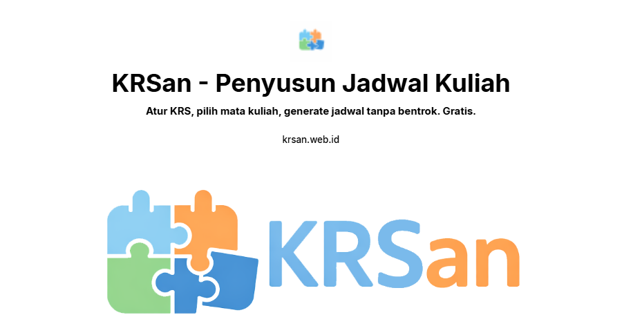

English: [README.md](README.md)

# KRSan v3

KRSan adalah aplikasi perencana jadwal kuliah (KRS) yang dibuat untuk mahasiswa perguruan tinggi di Indonesia. Aplikasi ini menggantikan proses perencanaan semester yang manual dan rawan kesalahan dengan alur kerja otomatis: pilih mata kuliah, dan aplikasi akan menghasilkan kombinasi jadwal yang bebas bentrok, baik melalui pencarian backtracking lokal maupun generator berbasis AI.

Aplikasi ini terbuka untuk umum secara default. Mengatur profil, memilih mata kuliah, membuat jadwal, dan menyimpan rencana ke arsip semuanya bisa dilakukan tanpa akun. Akun hanya diperlukan untuk tiga aksi yang menggunakan sumber daya di server: membagikan rencana, Smart Generate (AI), dan memperluas batas jumlah rencana.

## Daftar Isi

1. [Ringkasan](#1-ringkasan)
2. [Fitur Utama](#2-fitur-utama)
3. [Tumpukan Teknologi](#3-tumpukan-teknologi)
4. [Struktur Proyek](#4-struktur-proyek)
5. [Memulai](#5-memulai)
6. [Skrip yang Tersedia](#6-skrip-yang-tersedia)
7. [Catatan Arsitektur](#7-catatan-arsitektur)
8. [Kontribusi](#8-kontribusi)
9. [Lisensi dan Atribusi](#9-lisensi-dan-atribusi)

## 1. Ringkasan

Perencana ini bekerja sebagai alur empat langkah: Konfigurasi, Pemilihan, Visualisasi, dan Arsip.

Konfigurasi mengatur parameter akademik yang dipakai di seluruh langkah berikutnya: universitas, program studi (prodi), semester, dan target maksimal SKS.

Pemilihan mengambil data dari katalog mata kuliah utama, baik dimuat otomatis dari kurikulum prodi dan semester yang bersangkutan, maupun ditambahkan manual dari dialog pencarian katalog.

Visualisasi menampilkan kombinasi jadwal yang dihasilkan, dinilai berdasarkan sebaran hari, beban harian, dan heuristik lainnya, dengan dukungan untuk penyuntingan manual, berbagi tautan, dan cetak dalam format PDF.

Arsip menyimpan rencana yang telah disimpan, baik di Convex (saat masuk akun) maupun di local storage (anonim), dengan batas 30 rencana per pengguna.

## 2. Fitur Utama

Local schedule generation adalah pencarian backtracking pada seksi mata kuliah dengan pemangkasan konflik, gratis dan tidak memerlukan akun.

Smart Generate adalah generator berbasis AI yang menghasilkan tiga variasi jadwal yang beragam dan ternilai dari preferensi berbahasa natural (dosen yang diinginkan, hari libur, instruksi khusus). Fitur ini menggunakan satu kredit, dibatasi satu permintaan setiap 30 detik, dan dibatasi 5 kredit per hari, direset setiap tengah malam WIB.

Curriculum auto-load adalah satu aksi yang memuat seluruh mata kuliah milik prodi dan semester mahasiswa langsung dari tabel kurikulum yang dikelola admin.

Draft persistence menjaga langkah pemilihan (mata kuliah, kode yang dicentang, pilihan kelas yang dikunci, dan profil konfigurasi) tetap utuh meskipun halaman di-refresh, dan hanya terhapus melalui aksi reset yang eksplisit.

Plan archive and sharing memungkinkan rencana yang disimpan untuk diganti nama, dihapus, diekspor, atau dibagikan lewat tautan publik, yang terakhir ini memerlukan akun.

Panel admin mencakup pengelolaan katalog mata kuliah utama, pengelolaan kurikulum, dan Intelligence Scraper berbasis AI untuk mengubah teks jadwal tak terstruktur menjadi baris data mata kuliah yang terstruktur.

## 3. Tumpukan Teknologi

Runtime dan bahasa: Node.js, TypeScript strict mode, React 19 di atas Vite dengan Rolldown.

Styling: Tailwind CSS v4, dihubungkan lewat plugin Vite alih-alih PostCSS, dengan lapisan token (nilai warna OKLCH, skala tipografi bertingkat, dan penamaan utility semantik) yang didefinisikan di `src/index.css`.

UI primitives: Radix UI, dibungkus sebagai komponen bergaya shadcn lokal di `src/components/ui`.

Ikon: kumpulan kecil 36 ikon yang di-vendor di `src/components/ui/icon.tsx`, dihasilkan dari `lucide-react`, yang merupakan dependency khusus development dan tidak ikut terkirim ke client.

Backend: Convex, dipakai untuk database, langganan real-time, query dan mutation serverless, serta scheduled actions.

Autentikasi: Clerk, terintegrasi dengan Convex lewat `ConvexProviderWithClerk`.

Penyedia AI: Groq (`groq-sdk`), dipecah menjadi model utama dan model cadangan dari kelas ukuran yang berbeda sehingga satu penghentian model tidak dapat melumpuhkan Smart Generate sepenuhnya. Respons divalidasi lewat skema Zod sebelum dipercaya. LangChain sudah dihapus dari tumpukan teknologi; LangChain menambah bobot bundle yang besar untuk satu panggilan API dan tidak memberi kontribusi lain pada alur AI.

Validasi data: Zod v4, termasuk `z.toJSONSchema()` bawaannya untuk menghasilkan skema structured-output.

## 4. Struktur Proyek

```
convex/
  schema.ts            Definisi skema dan index database
  ai.ts                Action Smart Generate dan rantai penyedia AI
  admin.ts             Query, mutation, dan guard checkAdmin untuk admin
  users.ts             Siklus hidup pengguna, kredit, pemulihan identitas
  plans.ts             Query dan mutation arsip rencana
  lib.ts               Helper server-side bersama (auth, normalisasi hari)
  auth.config.ts       Konfigurasi issuer JWT Clerk

src/
  components/
    layout/            Navbar, Footer, kerangka halaman
    maker/              Layar Konfigurasi, Pemilihan, Visualisasi, Arsip
    admin/              Layar panel admin dan data hooks
    ui/                 Primitive komponen lokal (pembungkus Radix, kumpulan ikon)
  context/              LanguageContext, SessionContext
  hooks/                 Hooks bersama (useLocalStorage, useTutorial, usePlanArchive)
  hooks/maker/           Hooks sesi jadwal, smart-generate, share, dan arsip
  lib/                   Scheduler, rules, formatting, override per-prodi, logika periode
  types/                 Tipe TypeScript bersama

scripts/
  check-contrast.mjs     Guard kontras WCAG pada token desain
  check-typography.mjs   Guard skala tipografi
  check-i18n.mjs         Guard kunci terjemahan
  gen-icons.mjs          Generator kumpulan ikon

public/
  assets/                Aset statis, ilustrasi, font
```

## 5. Memulai

### Prasyarat

Node.js versi 22 ke atas, npm, akun dan project Convex, serta akun dan aplikasi Clerk.

### Instalasi

Clone repository.

```bash
git clone https://github.com/indraprhmbd/krs-an.git
cd krs-an
```

Install dependencies.

```bash
npm install
```

Buat `.env.local` di root proyek.

```env
VITE_CONVEX_URL=
VITE_CLERK_PUBLISHABLE_KEY=

# Opsional, hanya diperlukan untuk layanan pembersihan eksternal Intelligence Scraper.
VITE_AI_API_URL=
```

Atur variabel berikut sebagai Convex deployment environment variable, lewat dashboard Convex dan bukan `.env.local`, karena dibaca di sisi server di dalam Convex action.

```
GROQ_API_KEY
```

### Menjalankan aplikasi

Dua proses berjalan berdampingan selama development.

Terminal 1, frontend:

```bash
npm run dev
```

Terminal 2, sinkronisasi backend dan code generation:

```bash
npx convex dev
```

Keduanya harus berjalan. `convex/_generated/` dihasilkan oleh `npx convex dev`, dan tipe `api.*` yang basi atau hilang biasanya berarti proses tersebut belum berjalan.

## 6. Skrip yang Tersedia

`npm run dev`, Vite development server, khusus frontend.

`npx convex dev`, sinkronisasi backend dan code generation, dijalankan berdampingan dengan `npm run dev`.

`npm run build`, type-check dengan `tsc -b` lalu build dengan Vite.

`npm run build:cf`, build khusus Vite untuk deployment Cloudflare Pages, melewati langkah typecheck terpisah.

`npm run lint`, menjalankan ESLint ke seluruh proyek.

`npm run check:contrast`, memastikan rasio kontras WCAG 2.1 pada token warna di `src/index.css`.

`npm run check:typography`, memastikan skala tipografi dipakai secara konsisten, tanpa ukuran arbitrer dan tanpa font weight yang dilarang.

`npm run check:i18n`, memastikan setiap kunci terjemahan yang dipakai di source sudah didefinisikan, dan setiap placeholder terisi di lokasi pemanggilannya.

`npm run gen:icons`, meregenerasi `src/components/ui/icon.tsx` dari paket `lucide-react` yang terpasang.

`npm run preview`, menyajikan hasil build produksi secara lokal.

Perlu dicatat bahwa `npm run build` dan `npx convex dev` melakukan type-check terhadap file `tsconfig` yang berbeda, yaitu `tsconfig.app.json` dan `convex/tsconfig.json`. Error tipe di `convex/` bisa lolos dari satu tapi gagal di yang lain, jadi jalankan keduanya sebelum menganggap suatu perubahan sudah terverifikasi.

## 7. Catatan Arsitektur

Aplikasi ini khusus berbahasa Indonesia. Tidak ada toggle bahasa; seluruh teks yang dilihat pengguna berada dalam satu peta terjemahan di `src/context/LanguageContext.tsx`. Kode sumber, identifier, dan komentar tetap berbahasa Inggris.

Nilai hari-dalam-minggu dinormalisasi ke bentuk kanonik berbahasa Inggris, `Mon` sampai `Sun`, di setiap jalur penulisan, baik di client maupun di server, dan hanya diterjemahkan kembali ke Bahasa Indonesia di lapisan tampilan, lewat `src/lib/schedule-format.ts`.

Pembuatan jadwal mata kuliah bersifat lokal, yang gratis dan berada di `src/lib/scheduler.ts`, atau berbasis AI, yang menggunakan kredit dan berada di `convex/ai.ts`. Kedua jalur ini bermuara pada bentuk `Plan` yang sama.

Siklus hidup pengguna, `ensureUser` di `convex/users.ts`, memiliki jalur pemulihan identitas tiga tingkat, sehingga migrasi domain Clerk tidak membuat akun yang sudah ada menjadi yatim.

Token desain, tipografi, dan ikon dijaga oleh skrip guard otomatis yang tercantum di bagian 6, bukan hanya lewat konvensi, karena nilai-nilai arbitrer bisa muncul kembali secara diam-diam jika tidak dijaga.

## 8. Kontribusi

Fork repository, lalu buat feature branch dari `main`.

Lakukan perubahan, lalu jalankan `npm run build`, `npm run lint`, dan skrip `check:*` yang relevan sebelum membuka pull request.

Jaga agar pesan commit berfokus pada alasan di balik suatu perubahan, bukan sekadar mekanismenya.

Buka pull request ke `main` dengan deskripsi yang jelas tentang perubahan dan cara mengujinya.

## 9. Lisensi dan Atribusi

Proyek ini adalah alat bantu edukasi independen dan non-komersial. Data mata kuliah bersumber dari portal universitas yang bersifat publik.

Hak Cipta 2026, KRSan.

Dibuat oleh Indra Prihambada (https://github.com/indraprhmbd).
